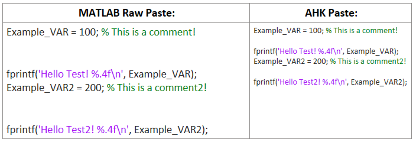

# MATLAB-Clipboard-Formatter
AHK Script to format MATLAB code for pasting into OneNote, Google Docs, etc.

This script takes MATLAB copied code and formats it to, in my case, be smaller with shorter line height. It also removes the duplicate new lines found when pasting MATLAB code.

To use the script install AHK V2 and run the `FormatMATLABClipboard.ahk` then press F2 to paste the formatted contents. 
If you'd like to change the pasted **font size** or **line height** they can easily be modified near the top of the script under `Config`.

## Formatting Example:
To the left is pasting straight from MATLAB to OneNote, the right is using this script to paste. 
